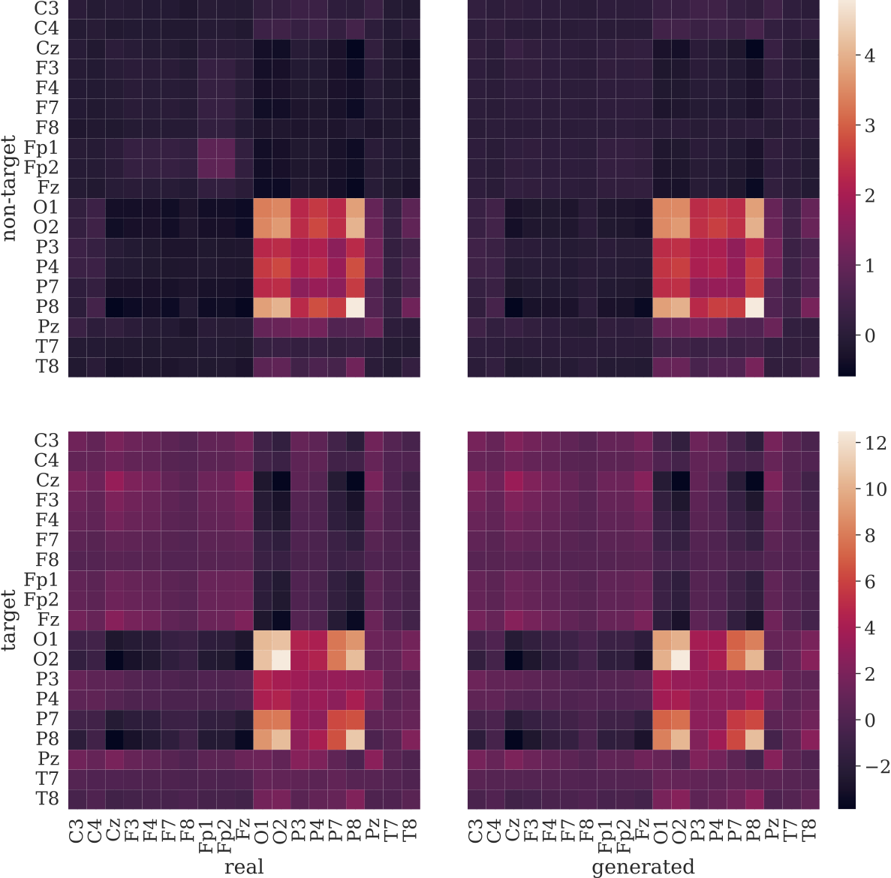
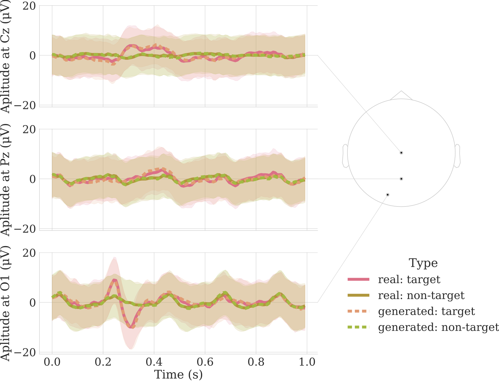

# Synthesizing EEG Signals from Event-Related Potential Paradigms with Conditional Diffusion Models

## Description
Reproduce the work from the paper titled "Synthesizing EEG Signals from Event-Related Potential Paradigms with Conditional Diffusion Models".

## Installation 
```
conda create --name Diffusion python==3.11.7
conda activate Diffusion
poetry install
```

## Usage

### Training diffusion model
Training the model can be done by running:
```
train.py
```

### Sampling
Sampling can be done by running:
```
inference.py
```

The checkpoint used for sampling can be changed in inference.py. The checkpoint after 600k training steps is provided using Huggingface. Additionally, the combination of session, subject, and label that is sampled can also be changed. 

### Training EEGNet
Training EEGNet for FID and IS computation can be done by running:
```
pretrain_eegnet.py
```

## Preview
The Spatial Covariance matrices of the real and generated target and non-target data |  Comparison of target and non-target real and generated data at three channels of subject 52 in session 1
:-------------------------:|:-------------------------:
 | 

All the article figures can be found in the [`figures`](figures) folder.

## Huggingface
The trained EEGNet that is used to compute the FID:

https://huggingface.co/guido151/EEGNetv4

The diffusion model after 600k training steps:

https://huggingface.co/guido151/checkpoints

## Support
For help or issues with the code you can either open an issue or send an e-mail to guido.klein@ru.nl

## Authors and acknowledgment
Guido Klein

SDE framework by Song and Colleagues (https://github.com/yang-song/score_sde_pytorch/blob/main/)

EEGWave neural network by Torma and Szegletes (https://github.com/tszab/eegwave-dpm/tree/master)


## Citing

If you use this code in a scientific publication, please cite this work as:
```bibtex
@article{klein2024synthesizing,
  title={Synthesizing EEG Signals from Event-Related Potential Paradigms with Conditional Diffusion Models},
  author={Klein, Guido and Guetschel, Pierre and Silvestri, Gianluigi and Tangermann, Michael},
  journal={arXiv preprint arXiv:2403.18486},
  year={2024}
}
```

# Licence

All work that does not have the Apache 2.0 notice in the code is licenced under the BSD-3-Clause license. If the Apache 2.0 notice is in the top of the file, this notice extends to the complete file, if the notice is in a function, then it is only applicable to that particular function. The work under the Apache 2.0 licence is attributed to Song and Colleagues.
